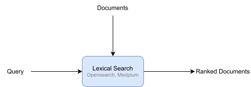
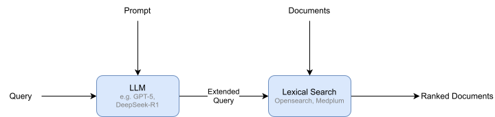
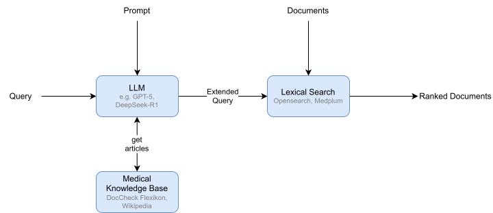

## Approaches

The search core of iPA can be implemented in different ways.
As part of the research project, three different approaches will be evaluated.
The final product might combine these approaches in a hybrid search system.
This enables finding both exact matches and semantically related results (e.g., through relationships like "is symptom of").

The core methodology is shared between all approaches beyond lexical search:
The physician's query is expanded with semantically related search queries.
This list of queries is then concatenated via "OR" operators.

> [!tip] Example
> ```mermaid
> flowchart LR
> query(["&quot;diabetes&quot;"])
> query_expansion[query expansion]
> expanded_query(["&quot;diabetes OR HbA1c OR polydipsia [...]&quot;"])
> 
> query-->query_expansion-->expanded_query
> ```

### Lexical Search



This approach uses the BM25 algorithm to find documents relevant to the physician's (not expanded) query.
It is the baseline for all advanced approaches.

### LLM Query Expansion

Using an LLM, the query given by the physician is expanded into a set of semantically relevant queries.

## Long-context prompting



This approach relies on the knowledge internalized by the LLM during training.

## Using a Medical Knowledge Base



By using an external knowledge base, it might be possible to use smaller LLMs and therefore reduce latency during query expansion.
The knowledge base is implemented as a LLM tool, meaning the LLM can decide whether the information in an article is sufficient.
If not, it can fetch more (relevant) articles.
